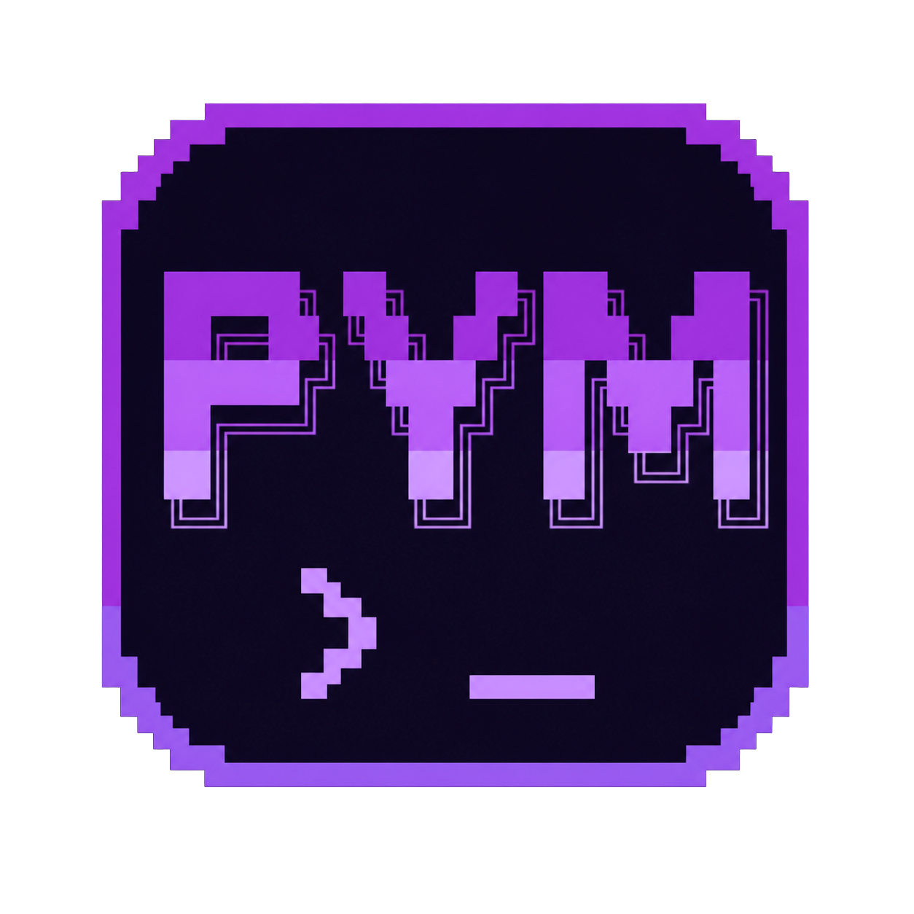

<div align="center">



**Super PyMan — Python Version Manager**

[](https://github.com/dh4r10/py-man/releases)
[](https://github.com/dh4r10/py-man/releases/latest)
[](https://github.com/dh4r10/py-man/releases/latest)
[](https://www.rust-lang.org/)
[](LICENSE)

🇺🇸 [English](#-english) · 🇪🇸 [Español](#-español)

[Install](#installation) · [Quick start](#quick-start) · [Commands](#commands)

</div>

---

## 🇺🇸 English

_Manage multiple Python versions from the terminal._  
_Single binary. No dependencies. No admin rights required._

### Installation

#### Windows — via npm

```bash
npm install -g super-py-man
```

Then add this to your PowerShell `$PROFILE`:

```powershell
pvm env | Out-String | Invoke-Expression
```

#### Windows — via installer

Download the installer from the [latest release](https://github.com/dh4r10/py-man/releases/latest):

```
pvm-windows-x86_64-X.X.X.exe
```

Run the installer and follow the wizard. When done:

- `pvm.exe` is placed in `%LOCALAPPDATA%\pvm\`
- That path is added to the user PATH automatically
- PowerShell profile is configured optionally

> Does not require administrator privileges.  
> Antivirus may need to be disabled during installation.

#### Linux

```bash
curl -fsSL https://raw.githubusercontent.com/dh4r10/py-man/master/install.sh | bash
```

The script detects your architecture (`x86_64` or `aarch64`), downloads the right binary, and configures your shell automatically (`.bashrc`, `.zshrc`, and fish). Open a new terminal and `pvm` is ready to use.

### Quick Start

**Windows**

```powershell
pvm install 3.12.13
pvm use 3.12.13
python -V
# Python 3.12.13
```

**Linux**

```bash
pvm install 3.13.3
pvm use 3.13.3
python --version
# Python 3.13.3
```

### Commands

| Command                          | Description                                                          |
| -------------------------------- | -------------------------------------------------------------------- |
| `pvm install <version>`          | Download and install a Python version                                |
| `pvm use <version>`              | Switch the active version                                            |
| `pvm list`                       | List installed versions (`*` marks the active one)                   |
| `pvm list-remote`                | List installable versions (python-build-standalone on Linux, python.org on Windows) |
| `pvm list-remote --filter 3.12`  | Filter by version prefix                                             |
| `pvm uninstall <version>`        | Remove an installed version                                          |
| `pvm default <version>`          | Set the global default version                                       |
| `pvm env`                        | Print the command to add `~/.pvm/bin` to your shell PATH             |
| `pvm venv <dir>`                 | Create a virtual environment pinned to the active version            |
| `pvm uninstall-self`             | Uninstall PVM from the system                                        |

### Virtual Environments

PVM pins each venv to the real version path, not the active alias. Running `pvm use 3.14.0` later will not affect existing venvs.

```bash
# Active version
pvm venv .venv

# Specific version without changing the active one
pvm -3.12.13 venv .venv
```

**Windows**
```powershell
.venv\Scripts\activate
python -V
```

**Linux**
```bash
source .venv/bin/activate
python --version
```

### Supported Shells

`pvm env` detects your shell automatically. You can also specify it:

```bash
pvm env --shell bash         # export PATH="...:$PATH"
pvm env --shell zsh          # export PATH="...:$PATH"
pvm env --shell fish         # set -gx PATH "..." $PATH
pvm env --shell power-shell  # $env:PATH = "...;" + $env:PATH
pvm env --shell cmd          # @SET "PATH=...;%PATH%"
```

### How It Works

`~/.pvm/bin/` holds copies of the `pvm` binary renamed as shims (`python`, `pip`, etc.). When the OS runs `python`, it finds the shim, which resolves the active version and launches the real Python interpreter with `sys.executable` pointing to the exact version directory.

**Windows**
```
~/.pvm/
├── versions/3.12.13/tools/
│   ├── python.exe
│   └── Scripts/pip.exe
├── aliases/current/          ← NTFS junction → versions/3.12.13
└── bin/
    ├── python.exe            ← shim (copy of pvm.exe)
    └── pip.exe               ← shim (copy of pvm.exe)
```

**Linux**
```
~/.pvm/
├── versions/3.12.13/
│   ├── bin/python3
│   └── lib/
├── aliases/current           ← symlink → versions/3.12.13
└── bin/
    ├── python                ← shim (copy of pvm)
    └── pip                   ← shim (copy of pvm)
```

### Build from Source

Requires [Rust](https://rustup.rs/) 1.70+.

**Windows**
```powershell
git clone https://github.com/dh4r10/py-man
cd py-man
cargo build --release
# Binary at: target\release\pvm.exe
```

To build the Windows installer, install [Inno Setup 6](https://jrsoftware.org/isdl.php) and run:

```powershell
iscc installer\pvm.iss
# Installer at: dist\pvm-setup-X.X.X.exe
```

**Linux**
```bash
git clone https://github.com/dh4r10/py-man
cd py-man
cargo build --release
# Binary at: target/release/pvm
```

### Inspiration

Inspired by [fnm](https://github.com/Schniz/fnm) (Fast Node Manager) — the same philosophy applied to the Python ecosystem.

[🔝 Back to top](#)

---

## 🇪🇸 Español

_Gestiona múltiples versiones de Python desde la terminal._  
_Binario único. Sin dependencias. Sin permisos de administrador._

### Instalación

#### Windows — Vía npm

```bash
npm install -g super-py-man
```

Luego añade esto a tu `$PROFILE` de PowerShell:

```powershell
pvm env | Out-String | Invoke-Expression
```

#### Windows — Vía instalador

Descarga el instalador de la [última release](https://github.com/dh4r10/py-man/releases/latest):

```
pvm-windows-x86_64-X.X.X.exe
```

Ejecuta el instalador y sigue el wizard. Al finalizar:

- `pvm.exe` queda en `%LOCALAPPDATA%\pvm\`
- Esa ruta se añade al PATH del usuario automáticamente
- El perfil de PowerShell se configura opcionalmente

> No requiere permisos de administrador.  
> Por ahora es necesaria la desactivación del antivirus durante la instalación.

#### Linux

```bash
curl -fsSL https://raw.githubusercontent.com/dh4r10/py-man/master/install.sh | bash
```

El script detecta tu arquitectura (`x86_64` o `aarch64`), descarga el binario correcto y configura tu shell automáticamente (`.bashrc`, `.zshrc` y fish). Abre una terminal nueva y ya puedes usar `pvm`.

### Inicio rápido

**Windows**

```powershell
pvm install 3.12.13
pvm use 3.12.13
python -V
# Python 3.12.13
```

**Linux**

```bash
pvm install 3.13.3
pvm use 3.13.3
python --version
# Python 3.13.3
```

### Comandos

| Comando                          | Descripción                                                          |
| -------------------------------- | -------------------------------------------------------------------- |
| `pvm install <version>`          | Descarga e instala una versión de Python                             |
| `pvm use <version>`              | Cambia la versión activa                                             |
| `pvm list`                       | Lista las versiones instaladas (`*` marca la activa)                 |
| `pvm list-remote`                | Lista versiones instalables (python-build-standalone en Linux, python.org en Windows) |
| `pvm list-remote --filter 3.12`  | Filtra por prefijo de versión                                        |
| `pvm uninstall <version>`        | Elimina una versión instalada                                        |
| `pvm default <version>`          | Establece la versión global por defecto                              |
| `pvm env`                        | Imprime el comando para añadir `~/.pvm/bin` al PATH del shell        |
| `pvm venv <dir>`                 | Crea un entorno virtual anclado a la versión activa                  |
| `pvm uninstall-self`             | Desinstala PVM del sistema                                           |

### Entornos virtuales

PVM ancla cada venv a la ruta real de la versión, no al alias activo. Si después haces `pvm use 3.14.0`, los venvs anteriores siguen apuntando a su versión original.

```bash
# Versión activa
pvm venv .venv

# Versión específica sin cambiar el use activo
pvm -3.12.13 venv .venv
```

**Windows**
```powershell
.venv\Scripts\activate
python -V
```

**Linux**
```bash
source .venv/bin/activate
python --version
```

### Shells soportados

`pvm env` detecta el shell automáticamente. También puedes especificarlo:

```bash
pvm env --shell bash         # export PATH="...:$PATH"
pvm env --shell zsh          # export PATH="...:$PATH"
pvm env --shell fish         # set -gx PATH "..." $PATH
pvm env --shell power-shell  # $env:PATH = "...;" + $env:PATH
pvm env --shell cmd          # @SET "PATH=...;%PATH%"
```

### Cómo funciona

`~/.pvm/bin/` contiene copias del propio binario `pvm` renombradas como shims (`python`, `pip`, etc.). Cuando el sistema operativo ejecuta `python`, encuentra el shim, que resuelve la versión activa y lanza el Python real con `sys.executable` apuntando al directorio exacto de la versión.

**Windows**
```
~/.pvm/
├── versions/3.12.13/tools/
│   ├── python.exe
│   └── Scripts/pip.exe
├── aliases/current/          ← junction NTFS → versions/3.12.13
└── bin/
    ├── python.exe            ← shim (copia de pvm.exe)
    └── pip.exe               ← shim (copia de pvm.exe)
```

**Linux**
```
~/.pvm/
├── versions/3.12.13/
│   ├── bin/python3
│   └── lib/
├── aliases/current           ← symlink → versions/3.12.13
└── bin/
    ├── python                ← shim (copia de pvm)
    └── pip                   ← shim (copia de pvm)
```

### Compilar desde código fuente

Requiere [Rust](https://rustup.rs/) 1.70+.

**Windows**
```powershell
git clone https://github.com/dh4r10/py-man
cd py-man
cargo build --release
# Binario en: target\release\pvm.exe
```

Para generar el instalador de Windows, instala [Inno Setup 6](https://jrsoftware.org/isdl.php) y ejecuta:

```powershell
iscc installer\pvm.iss
# Instalador en: dist\pvm-setup-X.X.X.exe
```

**Linux**
```bash
git clone https://github.com/dh4r10/py-man
cd py-man
cargo build --release
# Binario en: target/release/pvm
```

### Inspiración

Inspirado en [fnm](https://github.com/Schniz/fnm) (Fast Node Manager) — misma filosofía aplicada al ecosistema Python.

[🔝 Volver arriba](#)
